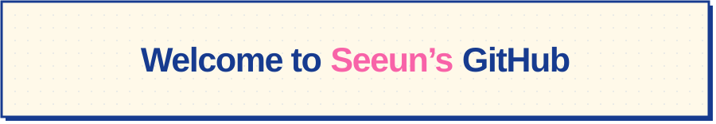
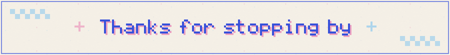

<!-- Assets: node tools/generate-assets.mjs · Palette: ink #173b8f, cream #fff9e9, pink #f863a8, yellow #ffe66f, mint #a9eee4. -->

  
  
  

## Hello, I'm Seeun Kim.

관찰한 것을 글로 정리하고, 낯선 도구를 배워 아이디어를 화면에 옮깁니다. 
좋아하는 것과 새로 배운 것 사이를 [theSen.log](https://the2en.github.io/)에 기록합니다.

`SEOUL, KR` · `WEB` · `DATA` · `AI` · `WRITING`

### 01 / Things I made

| 🌱 POP TREE | ◎ POTHOLE DETECTION |
| :--- | :--- |
| 소비 기록과 나무 성장, GPT 기반 금융상품 추천을 연결한 팀 프로젝트. **Vue · Django · GPT** [Repository ↗](https://github.com/the2en/poptree) | 도로 이미지 전처리와 포트홀 탐지를 실험한 AI 챌린지. **Python · OpenCV · Computer Vision** [Repository ↗](https://github.com/the2en/ssafy_ai_challenge) |
| **▥ ESG PREDICTION** | **✦ THESEN.LOG** |
| 기업 재무 데이터와 ESG 등급을 정리하고, 분류·회귀 모델로 예측을 실험한 프로젝트. **Python · Pandas · scikit-learn** [Repository ↗](https://github.com/the2en/ESG_Prediction) | 글, 취향, 프로젝트를 모아둔 레트로 도트 스타일의 개인 블로그. **HTML · CSS · JavaScript** [Repository ↗](https://github.com/the2en/the2en.github.io) · [Visit ↗](https://the2en.github.io/) |

### 02 / My toolbox

**Languages & data**

  
  
  
  
  

**Currently studying**

  
  
  

**Tools**

  
  
  
  
  
  
  

### 03 / Say hello

[iblue0126@gmail.com](mailto:iblue0126@gmail.com) · [GitHub](https://github.com/the2en) · [solved.ac](https://solved.ac/profile/paff1984)

<strong>ACTIVITY.LOG — Languages & algorithm</strong>

#### Top languages

#### Algorithm

 

